# Memory Manipulator - Documentation
## Date: Friday 31 October 2025

### Notes:
A preview video is found in the Files folder.

### Documentation:
This is an article about the whole process making this software, so it might be a long one!

Once I cheated in my 3D FPS game, I asked Gemini what could be the best next step and it said “Make a custom C++ program that successfully finds and writes to your FPS game's memory (replacing Cheat Engine)”.

And it gave me these steps:  
"  
- Identify the Target: The tool must find the Process ID (PID) of your running FPS game. Asking the user to input the game's name (MyGame.exe) is the simplest way.
- Gain Access: Once the PID is found, the tool must open the process handle with the necessary permissions (e.g., PROCESS_VM_READ and PROCESS_VM_WRITE).
- Read the Memory: The tool must read the exact memory address of the health variable (which you found using Cheat Engine) and display the current value. This validates the tool is working.
- Write the Memory: The tool must prompt the user for a new health value (e.g., 999) and write that value directly to the memory address.
- Clean Up: The tool must properly close the process handle to release resources.  

"  

And with that the journey began!

<br><br>

**Day 1: Wednesday 29 October 2025**  
I don't know a lot about processes, so I started with learning more about them. First I watched this [video](https://youtu.be/vLwMl9qK4T8?si=wVWeNiKLKF0QJsEK)

It was an insightful video and now I got curious to dive deeper to know more about processes, CPUs, the difference between CPU cores and threads, but that's out of scope of this project so I won't put it in the article.

With some more research, I have more knowledge about the topic. To summarize, a process is just an active instance of a program. A program is singular and stored in the storage, but there can be multiple of the same process (like opening two MS word windows) and stored in RAM. Each process has a unique ID, isolated personal resources, at least one thread and other data.

Now that I know what is a process, time to make the first part of the program, accepting the name of the active process as a user input.

I couldn't decide if I wanted to make the project using C or C++ so I used both. That's why there are 2 versions of this program. And with that, I can practice both languages.

**Step 1: Quick Testing**  
I wanted to know how to get the PID of a software before doing anything. So I researched about it and it turned out it's in the windows header file. I tested it by getting the PID of this program and printing it:  
```c
DWORD pid = GetCurrentProcessId(); // DWORD is just an unsigned type of long
```

**Step 2: Getting the Name of the Program**  
Now, I made a function that takes the name of the program from the user and returns it to the main function.

**Step 3: Getting the Process ID of that Program**  
I'm so new to this. So I asked Gemini and ChatGPT on how to do it in C, and both of them told me to use the ToolHelp API and they gave me this function:

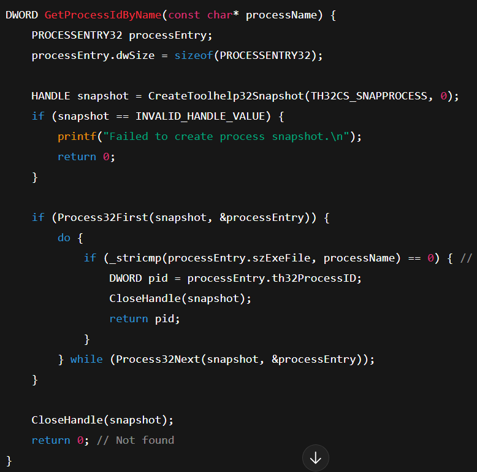

I think that's the answer, but this is cheating, it's not learning, I want to learn this and dive deep into it so that I can work with it as I'm writing a print statement. I learnt it by watching this [video](https://youtu.be/S4lQwJawOzI?si=e022Dm_7R435JqfB).

I've learned from this video:
- The difference between Header files and DLL files.
- The name origins of some variables like DWORD, and HANDLE.
- Some naming conventions.

[Microsoft Documentation](https://learn.microsoft.com/en-us/windows/win32/api/_toolhelp/)

<br><br>

**Day 2: Thursday 30 October 2025**  
One of the things I also researched was the meaning of “snapshot”, and it turned out to be just a copy of all current processes in the current time.

Now that I researched and understood different words and needs for this algorithm, I stumbled on another problem, which is how to combine all these syntax into a meaningful algorithm? I asked ChatGPT for an advice and one of the points he gave me is this:

"  
- Name the goal in one short sentence.
- Break down the goal into steps.
- Map each step to the language feature you need.  

**Concrete example:**  
**Goal:** find PID for “appName.exe” given from user.

**Pseudocode:**  
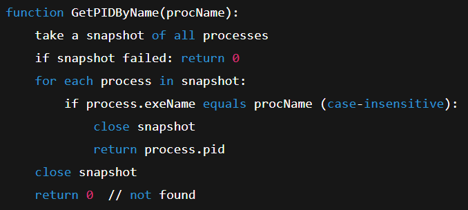

**Map to Windows API:**  
- “Take snapshot” --> CreateToolhelp32Snapshot(TH32CS_SNAPPROCESS, 0)
- “Iterate” --> PROCESSENTRY32, Process32First, Process32Next
- “Compare” --> _stricmp (or lstrcmpiA)
- “PID field” --> processEntry.th32ProcessID
- “Close” --> CloseHandle(snapshot)

"

This is good advice, I always broke down projects into smaller steps but not the smaller steps into even smaller steps so that's something.

Regarding using _stricmp for the comparison, I don't know this function so I researched it and it turns out it's very simple, it takes 2 strings and makes them lowercase, and compares them. If they are identical, it returns 0.

**Note:** this is the C version not the C++ one.

Now that I have a prototype I made the algorithm on my own:
```c
DWORD GetProcessIdOfAProgram(char* ProgramName) {
    // Step 1: Take a snapshot of all processes
    HANDLE snapshot = CreateToolhelp32Snapshot(TH32CS_SNAPPROCESS, 0);
    
    // Step 2: Checking for failure
    if (snapshot == INVALID_HANDLE_VALUE) {
        printf("Couldn't get a snapshot\n");
        return 0;
    }

    // Step 3: Looping through the snapshot
    // first we need to create an object of the struct that holds the information of the process
    PROCESSENTRY32 processEntry;
    
    // then we need to define its size, it's size is basically the size of the struct
    processEntry.dwSize = sizeof(PROCESSENTRY32);

    // Now to start we need to take our first process from the snapshot and put it in the struct object
    // We put it inside an if in case there is any errors so we skip the loop entirely
    if (Process32First(snapshot, &processEntry)) {
        // now start the loop, we need a do while since we already got the first process
        do {
            // using _stricmp to test the names
            if (_stricmp(processEntry.szExeFile, ProgramName) == 0) {
                // Get the id of that process
                DWORD pid = processEntry.th32ProcessID;

                // closw the snapshot
                CloseHandle(snapshot);

                // return the process id
                return pid;
            }
        } while (Process32Next(snapshot, &processEntry)); // while there is a next snapshot to test
    }

    // If we got nothing, we need to close the snapshot anyways and return 0
    CloseHandle(snapshot);
    return 0;
}
```

Now once I tested the program, I got a warning on the function that takes the program name from the user:

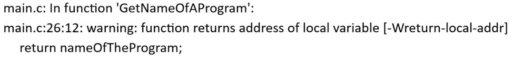

This the function:
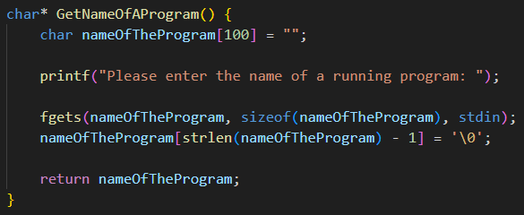

After researching, I've learned that the problem is that since I'm declaring the variable inside the function, once returned it will get deleted which will leave a pointer to nothing. So I thought about just making the variable in the main function. And that's the new function:
```c
char* GetNameOfAProgram(char* nameOfTheProgram, int size) {
    printf("Please enter the name of a running program: ");
    fgets(nameOfTheProgram, size, stdin);
    nameOfTheProgram[strlen(nameOfTheProgram) - 1] = '\0';
}
```

Now let's test the program. I tested the program 4 times: Notepad opened, Notepad closed, MS Word opened, and MS Word closed. And these are the results:  

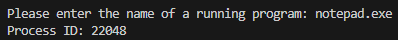

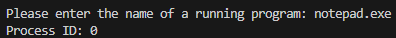

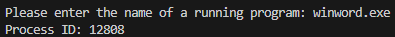

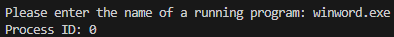

And with that, I implemented the function in the C++ version and now step 3 is done.


**Step 4: Gaining access to the program with Read/Write privileges.**  
I don't know how to do that so I researched and found [this](https://learn.microsoft.com/en-us/windows/win32/api/processthreadsapi/nf-processthreadsapi-openprocess). It's straight forward, OpenProcess takes 3 arguments, the privileges we want, if it can be inherited, and the process ID. And returns a handle in the end.

With that I made the function in C:
```c
HANDLE OpenAProgrambyId(DWORD programId) {
    DWORD access = PROCESS_QUERY_INFORMATION | PROCESS_VM_READ | PROCESS_VM_WRITE | PROCESS_VM_OPERATION;
    HANDLE processToOpen = OpenProcess(access, FALSE, programId);
    return processToOpen;
}
```

And handled it in the main function:  
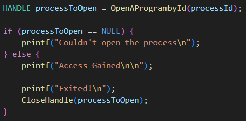

Testing:  
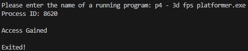

It's working, so I implemented it now in C++, but I encountered a problem there in my function that gets the name of the program. The problem is that I don't see my game at all. This is the current one:

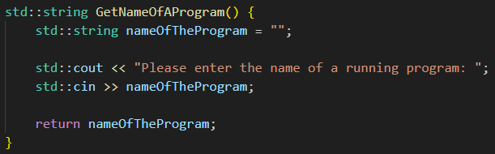

After researching, I found that cin doesn't see after spaces, so when I write “p4 - 3d fps platformer.exe” it only sees “p4”. The solution to this is to replace it with std::getline(std::cin, nameOfTheProgram);

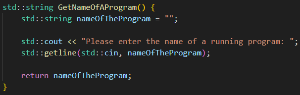

And with that both versions work and step 4 is done!

**Step 5: Reading and Writing to Memory**  
First, reading memory. I want to try mimicking the behavior of Cheat Engine. First enter an initial value, then keep searching while the value changes until I find the address.

I think this is a complex algorithm so I'll plan it first:

For the initial search, I think I should pass the opened handle, and the value we want to search. In the function, we will calculate the starting address and the ending address of the process. Then search every single address for this value.

I'm thinking about making an array of addresses, and fill it with the addresses that contain the value we want and return that array. That way, when we change the value of the variable, we can pass that array into another function called NextSearch for example, alongside the new value, and search this specific array for the address and in the end do the same thing, make a new list with the new addresses and return it.

<br><br>

**Day 3: Friday 31 October 2025**  
Before continuing with reading/writing, I thought yesterday about making the program more useful by making a main menu that always loops until the user exits the program. That way, the user can read and write as much as he wants in a single run instead of always doing one functionality and exit the program. So I made it today, this is the base of it:

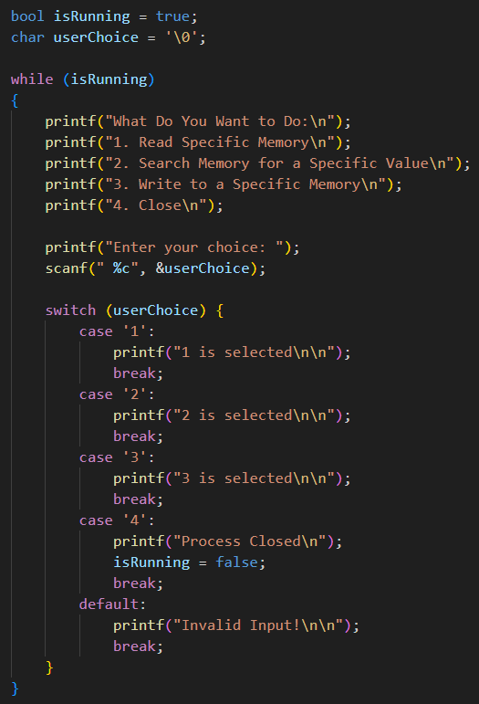

Now let's start with the first function, I also thought yesterday about making a function that lets the user search a specific memory address instead of always searching all addresses for a specific value. That way, if the user already knows the memory address, he can directly look up the value of it. After researching, I found that there is a function called ReadProcessMemory which does exactly that.

After researching on this function and figuring out on how to set it up, I made this function:

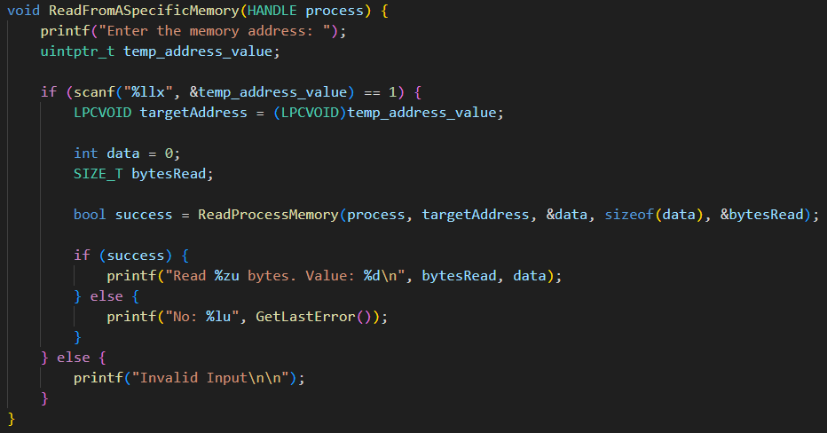

First I ask the user for the address, if the address is valid I convert it into a LPCVOID which is basically a long pointer type. After that I declare a default data variable to store the data of the memory in it. And declared a variable to store the byte size of the value that will be read from memory. Then I called the ReadProcessMemory and inserted all the attributes. If the reading was successful I printed them, if not then I displayed the error code to understand the problem.

To test this function, I opened my game and cheat engine, and found the address of the weapon ammo I have, then inserted the into this program. At first I was getting an error of 299. After a lot of research, I found that the problem was my compiler is a 32-bit compiler and I need a 64-bit one. I was using the MinGW 32-bit compiler. Then after researching, I found the newest MinGW 64-bit compiler and installed it. Then I tested the software again and it worked this time:

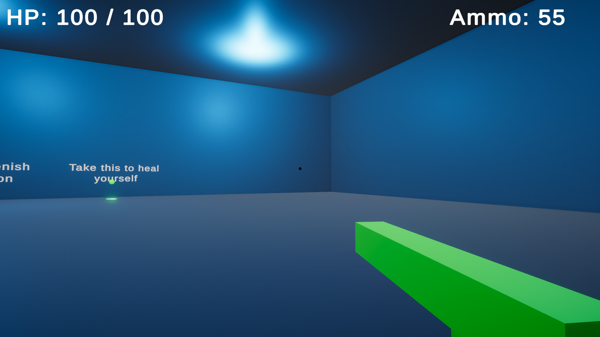

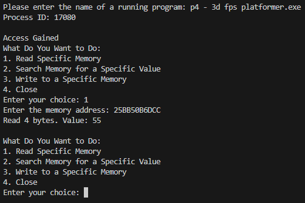

After that I implemented the loop and the function into the C++ version of the program.

Next, It's time to make the memory searching function. For me this was the most complicated algorithm in this project, I researched and couldn't find a lot of useful information online. So I used the help of ChatGPT to complete it fully. And here are the results.

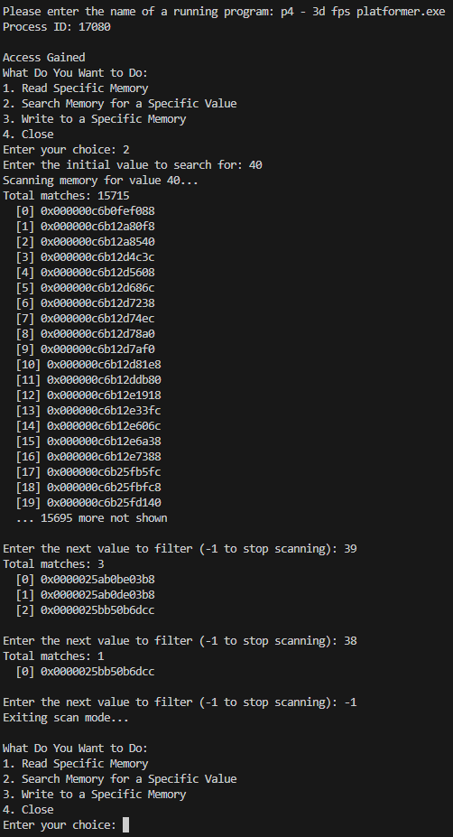

Then I implemented the C++ version of this algorithm. And now, the final thing left is to write to the memory. I think this would be very similar to “reading a specific process”. And there is a function called WriteProcessMemory.

So I'll try to just do the same thing with changes to write instead of reading and try it. I made the function, it didn't match the read function 100%, it needed some tweaks but it worked and the writing works!

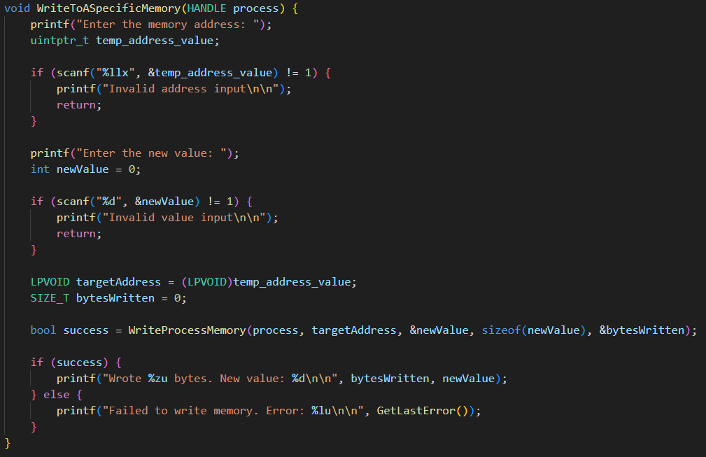

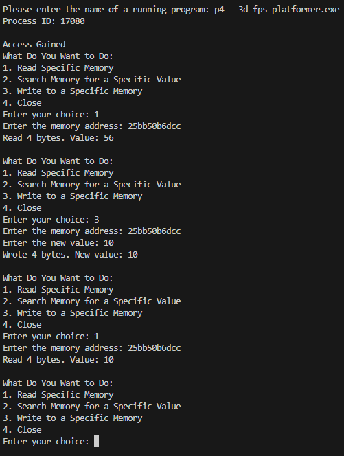

And with that, the project is done!

It was a really wonderful experience, I started knowing almost nothing, but finished knowing tons of new information. I'm not happy I ended up relying on ChatGPT to be able to write the memory scanning algorithm so I'll definitely put more time on it to really get the hang of it. And now I know that the majority of my work as a low level security is interacting with the Windows API, so I'll definitely invest a lot of time in it.

Thank you for reading the article! I hope you liked it!